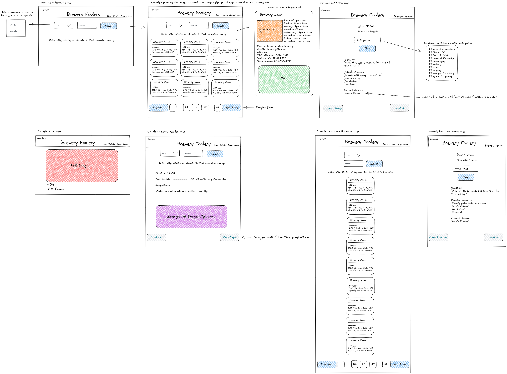

# Project 1 - Brewery Foolery

## Description


## User Story

```
As a frequenter of breweries, I’d like to explore my city’s breweries, as well as other cities when I travel, so I can broaden my beer-related horizons! Once I am at the brewery, I’d like to keep me and my friends entertained with a game of trivia with multiple categories.
```

## Acceptance Criteria

```

```

## Installation

N/A

## Usage

Search for breweries and play bar trivia.

### Deployed Site
https://fevercatdream.github.io/project-1/

<br />

### Wireframe


<br />

## Credits

Collaborators: Abi Kumagai, Thalissa Valery, and Ryan Feeney Wood

Tutor: Doug Kumagai:
<br />
https://www.linkedin.com/in/doug-kumagai/
<br />
https://github.com/ndesmic


mdn web docs: https://developer.mozilla.org/en-US/

Day.js: https://day.js.org/en/

Bulma: the modern CSS framework that just works: https://bulma.io/

Two-Letter State and Territory Abbreviations: https://www.faa.gov/air_traffic/publications/atpubs/cnt_html/appendix_a.html

JavaScript implementation of the Durstenfeld shuffle, an optimized version of Fisher-Yates: https://stackoverflow.com/questions/2450954/how-to-randomize-shuffle-a-javascript-array


## License

Please refer to the LICENSE in the repo.
