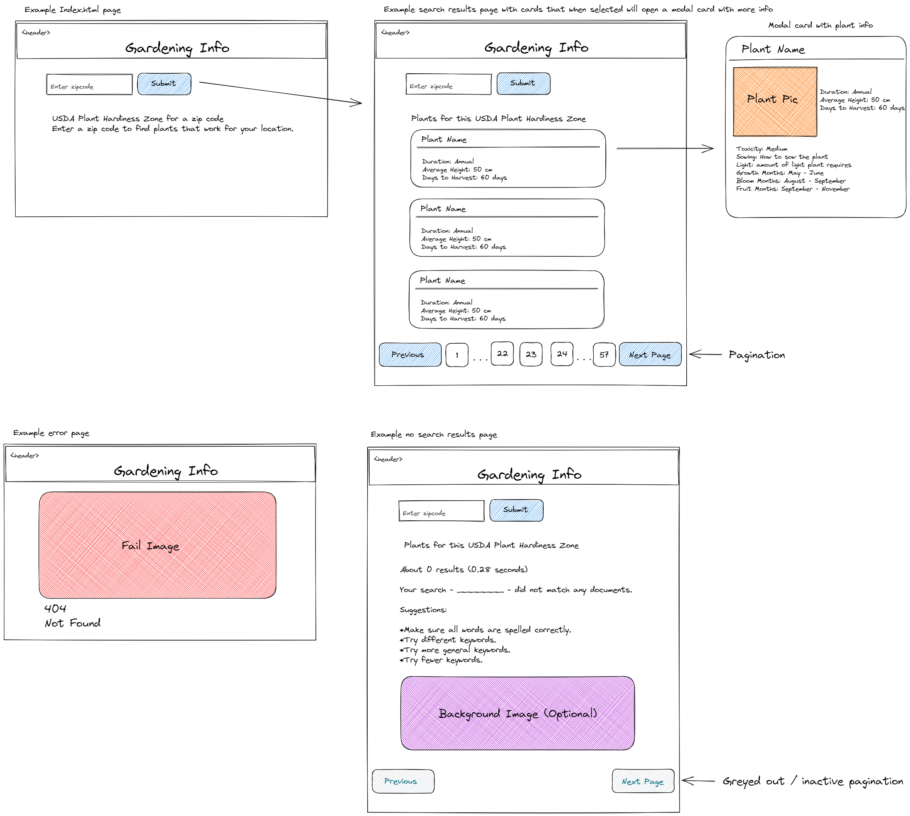

# project-1

## Description


## User Story

```

```

## Acceptance Criteria

```

```

## Installation

N/A

## Usage


### Deployed Site


<br />

### Wireframe


<br />

## Credits

Collaborators: Abi Kumagai, Thalissa Valery, and Ryan Feeney Wood

Tutor: Doug Kumagai:
<br />
https://www.linkedin.com/in/doug-kumagai/
<br />
https://github.com/ndesmic


mdn web docs: https://developer.mozilla.org/en-US/

Day.js: https://day.js.org/en/

Bulma: the modern CSS framework that just works: https://bulma.io/


## License

Please refer to the LICENSE in the repo.
